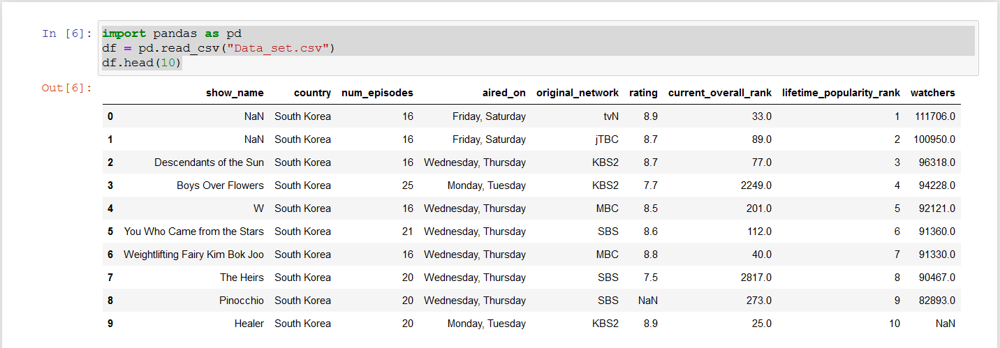
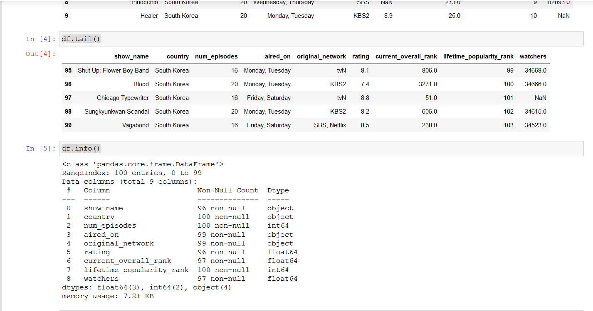
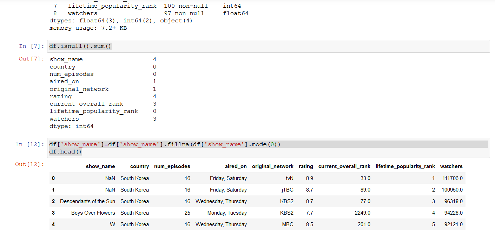
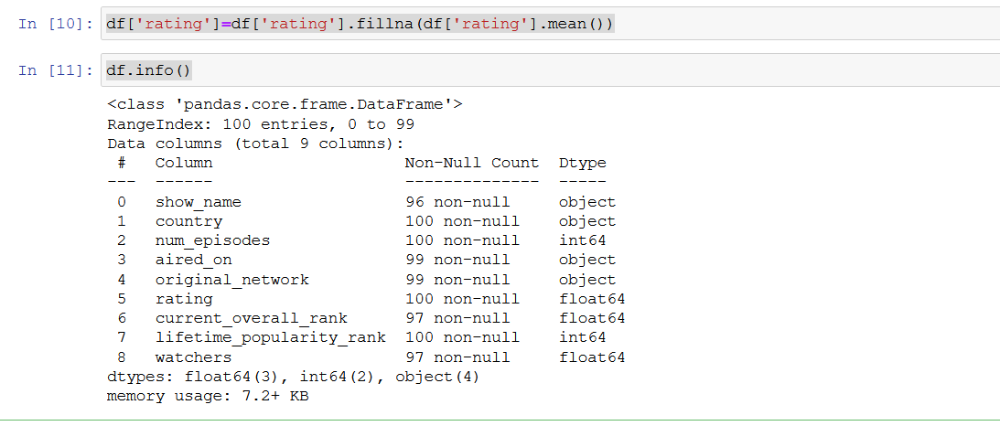
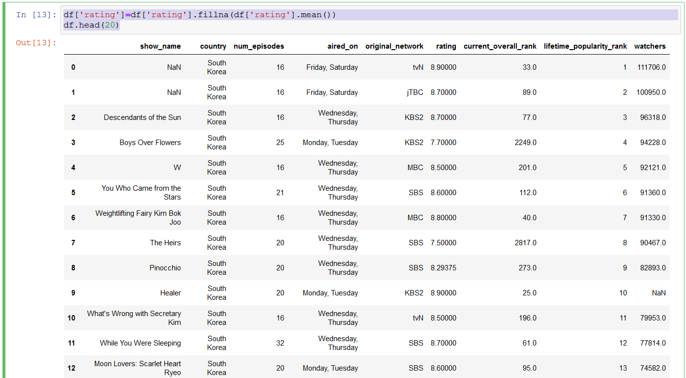
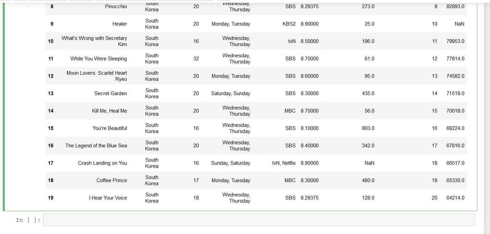

# Ex-01_DS_Data_Cleansing


## AIM
To read the given data and perform data cleaning and save the cleaned data to a file. 

# Explanation
Data cleaning is the process of preparing data for analysis by removing or modifying data that is incorrect ,incompleted , irrelevant , duplicated or improperly formatted. 
Data cleaning is not simply about erasing data ,but rather finding a way to maximize datasets accuracy without necessarily deleting the information. 

# ALGORITHM
### STEP 1
Read the given Data
### STEP 2
Get the information about the data
### STEP 3
Remove the null values from the data
### STEP 4
Save the Clean data to the file


# CODE:
 ```
 import pandas as pd
df = pd.read_csv("Data_set.csv")
df.head(10)
df.tail()
df.info()
df.isnull().sum()
df['show_name']=df['show_name'].fillna(df['show_name'].mode(0))
df.head()
df['rating']=df['rating'].fillna(df['rating'].mean())
df.info()
df['rating']=df['rating'].fillna(df['rating'].mean())
df.head(20)
```

# OUPUT:
 












## RESUT:
Hence the expected output was successfully executed.
